# MSM Benchmark Results

Comparison of multi-scalar multiplication (MSM) implementations:

- **Halo2**: `halo2curves` baseline implementation
- **CE-General**: Nova commitment engine — general-purpose path
- **CE-Small**: Nova commitment engine — small-scalar optimized path
- **BA**: Nova batch-add path (only applicable to 1-bit scalars)

Each section shows **throughput** (elements/sec, higher is better) and **speedup** (old→new, >1× = improvement).

> **old** = `v0.53.0` (before optimization)  
> **new** = `v0.57.0` (after optimization)

---

## BN254 Curve

### BitWidth: u1

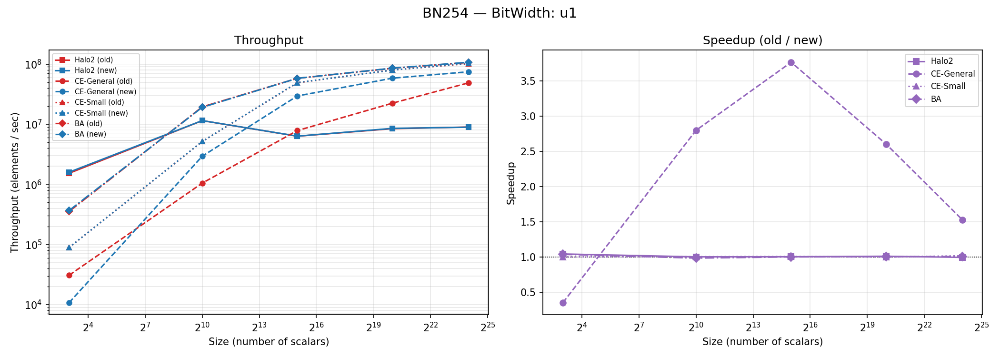

<em>Fig 1 — BN254 u1: Throughput & Speedup</em>

**Throughput (elements / sec)**

| Method | Version | 8 | 1 024 | 32 768 | 1 048 576 | 16 777 216 |
|--------|---------|--:|------:|-------:|----------:|-----------:|
| Halo2 | old | 1.53e+06 | 1.15e+07 | 6.32e+06 | 8.44e+06 | 8.98e+06 |
| Halo2 | new | 1.59e+06 | 1.15e+07 | 6.33e+06 | 8.52e+06 | 8.92e+06 |
| CE-General | old | 3.07e+04 | 1.05e+06 | 7.83e+06 | 2.24e+07 | 4.88e+07 |
| CE-General | new | 1.08e+04 | 2.93e+06 | 2.95e+07 | 5.83e+07 | 7.45e+07 |
| CE-Small | old | 8.89e+04 | 5.15e+06 | 4.89e+07 | 7.97e+07 | 1.02e+08 |
| CE-Small | new | 8.89e+04 | 5.17e+06 | 4.92e+07 | 7.96e+07 | 1.03e+08 |
| BA | old | 3.54e+05 | 1.94e+07 | 5.80e+07 | 8.52e+07 | 1.07e+08 |
| BA | new | 3.67e+05 | 1.91e+07 | 5.80e+07 | 8.55e+07 | 1.07e+08 |

**Raw Latency**

| Method | Version | 8 | 1 024 | 32 768 | 1 048 576 | 16 777 216 |
|--------|---------|--:|------:|-------:|----------:|-----------:|
| Halo2 | old | 5.24 µs | 89.26 µs | 5.19 ms | 124.24 ms | 1.87 s |
| Halo2 | new | 5.03 µs | 89.14 µs | 5.17 ms | 123.01 ms | 1.88 s |
| CE-General | old | 260.21 µs | 977.35 µs | 4.18 ms | 46.79 ms | 344.07 ms |
| CE-General | new | 743.86 µs | 349.01 µs | 1.11 ms | 17.98 ms | 225.15 ms |
| CE-Small | old | 90.01 µs | 198.83 µs | 670.26 µs | 13.15 ms | 164.85 ms |
| CE-Small | new | 89.97 µs | 198.06 µs | 666.30 µs | 13.18 ms | 162.16 ms |
| BA | old | 22.63 µs | 52.72 µs | 565.32 µs | 12.31 ms | 157.32 ms |
| BA | new | 21.82 µs | 53.60 µs | 564.94 µs | 12.26 ms | 156.32 ms |

**Speedup (old / new)**

| Method | 8 | 1 024 | 32 768 | 1 048 576 | 16 777 216 |
|--------|--:|------:|-------:|----------:|-----------:|
| Halo2 | 1.04× | 1.00× | 1.00× | 1.01× | 0.99× |
| CE-General | 0.35× | 2.80× | 3.77× | 2.60× | 1.53× |
| CE-Small | 1.00× | 1.00× | 1.01× | 1.00× | 1.02× |
| BA | 1.04× | 0.98× | 1.00× | 1.00× | 1.01× |

---

### BitWidth: u10

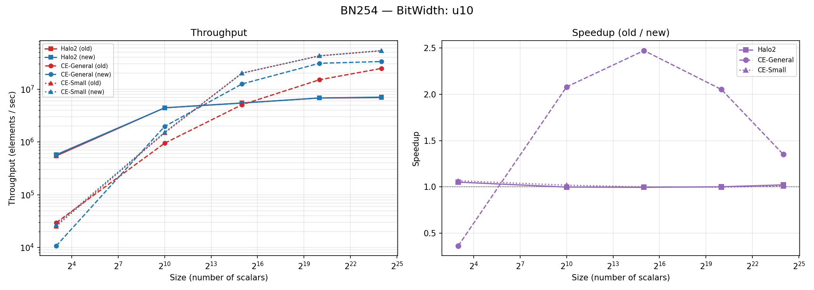

<em>Fig 2 — BN254 u10: Throughput & Speedup</em>

**Throughput (elements / sec)**

| Method | Version | 8 | 1 024 | 32 768 | 1 048 576 | 16 777 216 |
|--------|---------|--:|------:|-------:|----------:|-----------:|
| Halo2 | old | 5.45e+05 | 4.43e+06 | 5.47e+06 | 6.79e+06 | 6.91e+06 |
| Halo2 | new | 5.73e+05 | 4.42e+06 | 5.44e+06 | 6.80e+06 | 7.06e+06 |
| CE-General | old | 2.96e+04 | 9.46e+05 | 5.07e+06 | 1.51e+07 | 2.47e+07 |
| CE-General | new | 1.07e+04 | 1.97e+06 | 1.25e+07 | 3.09e+07 | 3.33e+07 |
| CE-Small | old | 2.54e+04 | 1.49e+06 | 2.01e+07 | 4.28e+07 | 5.33e+07 |
| CE-Small | new | 2.71e+04 | 1.51e+06 | 2.01e+07 | 4.27e+07 | 5.38e+07 |

**Raw Latency**

| Method | Version | 8 | 1 024 | 32 768 | 1 048 576 | 16 777 216 |
|--------|---------|--:|------:|-------:|----------:|-----------:|
| Halo2 | old | 14.67 µs | 231.18 µs | 5.99 ms | 154.42 ms | 2.43 s |
| Halo2 | new | 13.96 µs | 231.69 µs | 6.02 ms | 154.23 ms | 2.38 s |
| CE-General | old | 270.58 µs | 1.08 ms | 6.46 ms | 69.64 ms | 679.47 ms |
| CE-General | new | 746.09 µs | 520.43 µs | 2.61 ms | 33.94 ms | 503.28 ms |
| CE-Small | old | 315.12 µs | 688.52 µs | 1.63 ms | 24.48 ms | 314.95 ms |
| CE-Small | new | 295.61 µs | 676.04 µs | 1.63 ms | 24.58 ms | 311.93 ms |

**Speedup (old / new)**

| Method | 8 | 1 024 | 32 768 | 1 048 576 | 16 777 216 |
|--------|--:|------:|-------:|----------:|-----------:|
| Halo2 | 1.05× | 1.00× | 1.00× | 1.00× | 1.02× |
| CE-General | 0.36× | 2.08× | 2.47× | 2.05× | 1.35× |
| CE-Small | 1.07× | 1.02× | 1.00× | 1.00× | 1.01× |

---

### BitWidth: u16

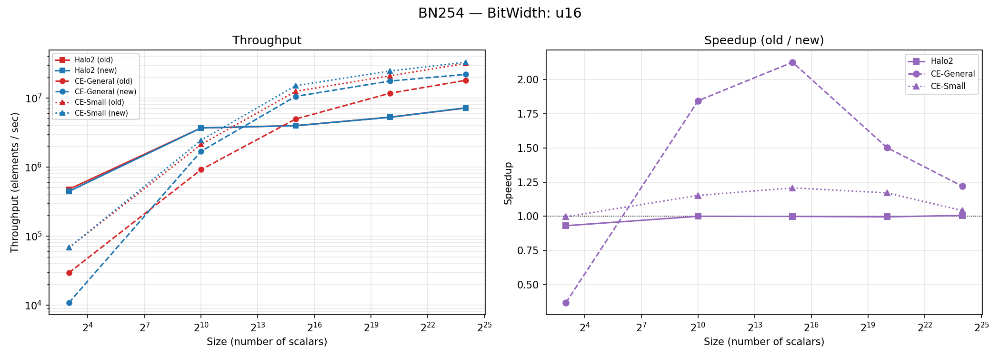

<em>Fig 3 — BN254 u16: Throughput & Speedup</em>

**Throughput (elements / sec)**

| Method | Version | 8 | 1 024 | 32 768 | 1 048 576 | 16 777 216 |
|--------|---------|--:|------:|-------:|----------:|-----------:|
| Halo2 | old | 4.75e+05 | 3.68e+06 | 3.97e+06 | 5.26e+06 | 7.13e+06 |
| Halo2 | new | 4.43e+05 | 3.68e+06 | 3.96e+06 | 5.24e+06 | 7.17e+06 |
| CE-General | old | 2.94e+04 | 9.16e+05 | 4.95e+06 | 1.17e+07 | 1.80e+07 |
| CE-General | new | 1.08e+04 | 1.69e+06 | 1.05e+07 | 1.76e+07 | 2.19e+07 |
| CE-Small | old | 6.80e+04 | 2.12e+06 | 1.24e+07 | 2.09e+07 | 3.16e+07 |
| CE-Small | new | 6.78e+04 | 2.44e+06 | 1.50e+07 | 2.45e+07 | 3.29e+07 |

**Raw Latency**

| Method | Version | 8 | 1 024 | 32 768 | 1 048 576 | 16 777 216 |
|--------|---------|--:|------:|-------:|----------:|-----------:|
| Halo2 | old | 16.83 µs | 278.43 µs | 8.26 ms | 199.24 ms | 2.35 s |
| Halo2 | new | 18.07 µs | 278.39 µs | 8.27 ms | 200.00 ms | 2.34 s |
| CE-General | old | 272.14 µs | 1.12 ms | 6.62 ms | 89.68 ms | 933.17 ms |
| CE-General | new | 738.63 µs | 606.11 µs | 3.11 ms | 59.71 ms | 765.52 ms |
| CE-Small | old | 117.60 µs | 483.20 µs | 2.63 ms | 50.06 ms | 531.58 ms |
| CE-Small | new | 118.04 µs | 419.24 µs | 2.18 ms | 42.75 ms | 510.28 ms |

**Speedup (old / new)**

| Method | 8 | 1 024 | 32 768 | 1 048 576 | 16 777 216 |
|--------|--:|------:|-------:|----------:|-----------:|
| Halo2 | 0.93× | 1.00× | 1.00× | 1.00× | 1.01× |
| CE-General | 0.37× | 1.84× | 2.13× | 1.50× | 1.22× |
| CE-Small | 1.00× | 1.15× | 1.21× | 1.17× | 1.04× |

---

### BitWidth: u32

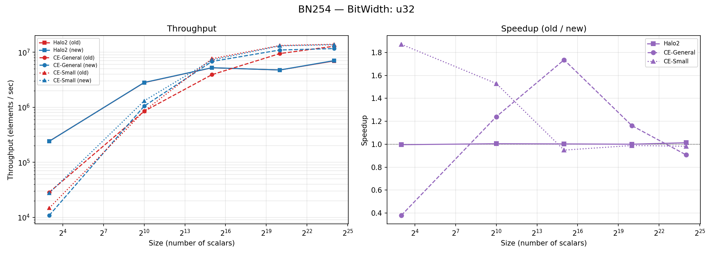

<em>Fig 4 — BN254 u32: Throughput & Speedup</em>

**Throughput (elements / sec)**

| Method | Version | 8 | 1 024 | 32 768 | 1 048 576 | 16 777 216 |
|--------|---------|--:|------:|-------:|----------:|-----------:|
| Halo2 | old | 2.42e+05 | 2.81e+06 | 5.22e+06 | 4.76e+06 | 6.95e+06 |
| Halo2 | new | 2.41e+05 | 2.82e+06 | 5.23e+06 | 4.76e+06 | 7.04e+06 |
| CE-General | old | 2.85e+04 | 8.47e+05 | 3.92e+06 | 9.46e+06 | 1.29e+07 |
| CE-General | new | 1.08e+04 | 1.05e+06 | 6.80e+06 | 1.10e+07 | 1.17e+07 |
| CE-Small | old | 1.48e+04 | 8.56e+05 | 7.62e+06 | 1.32e+07 | 1.39e+07 |
| CE-Small | new | 2.76e+04 | 1.31e+06 | 7.23e+06 | 1.31e+07 | 1.37e+07 |

**Raw Latency**

| Method | Version | 8 | 1 024 | 32 768 | 1 048 576 | 16 777 216 |
|--------|---------|--:|------:|-------:|----------:|-----------:|
| Halo2 | old | 33.12 µs | 364.82 µs | 6.28 ms | 220.44 ms | 2.41 s |
| Halo2 | new | 33.26 µs | 363.21 µs | 6.26 ms | 220.40 ms | 2.38 s |
| CE-General | old | 280.59 µs | 1.21 ms | 8.36 ms | 110.90 ms | 1.31 s |
| CE-General | new | 737.57 µs | 974.95 µs | 4.82 ms | 95.46 ms | 1.44 s |
| CE-Small | old | 541.89 µs | 1.20 ms | 4.30 ms | 79.17 ms | 1.20 s |
| CE-Small | new | 289.67 µs | 782.66 µs | 4.53 ms | 80.05 ms | 1.22 s |

**Speedup (old / new)**

| Method | 8 | 1 024 | 32 768 | 1 048 576 | 16 777 216 |
|--------|--:|------:|-------:|----------:|-----------:|
| Halo2 | 1.00× | 1.00× | 1.00× | 1.00× | 1.01× |
| CE-General | 0.38× | 1.24× | 1.74× | 1.16× | 0.91× |
| CE-Small | 1.87× | 1.53× | 0.95× | 0.99× | 0.98× |

---

### BitWidth: u64

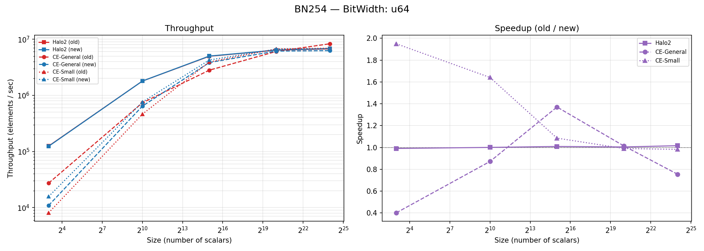

<em>Fig 5 — BN254 u64: Throughput & Speedup</em>

**Throughput (elements / sec)**

| Method | Version | 8 | 1 024 | 32 768 | 1 048 576 | 16 777 216 |
|--------|---------|--:|------:|-------:|----------:|-----------:|
| Halo2 | old | 1.25e+05 | 1.80e+06 | 4.97e+06 | 6.38e+06 | 6.73e+06 |
| Halo2 | new | 1.24e+05 | 1.80e+06 | 5.02e+06 | 6.41e+06 | 6.84e+06 |
| CE-General | old | 2.73e+04 | 7.37e+05 | 2.81e+06 | 6.07e+06 | 8.30e+06 |
| CE-General | new | 1.09e+04 | 6.42e+05 | 3.85e+06 | 6.15e+06 | 6.27e+06 |
| CE-Small | old | 8.08e+03 | 4.63e+05 | 3.93e+06 | 6.72e+06 | 6.92e+06 |
| CE-Small | new | 1.58e+04 | 7.60e+05 | 4.27e+06 | 6.65e+06 | 6.80e+06 |

**Raw Latency**

| Method | Version | 8 | 1 024 | 32 768 | 1 048 576 | 16 777 216 |
|--------|---------|--:|------:|-------:|----------:|-----------:|
| Halo2 | old | 63.98 µs | 569.73 µs | 6.59 ms | 164.31 ms | 2.49 s |
| Halo2 | new | 64.59 µs | 569.58 µs | 6.53 ms | 163.61 ms | 2.45 s |
| CE-General | old | 293.04 µs | 1.39 ms | 11.66 ms | 172.88 ms | 2.02 s |
| CE-General | new | 731.08 µs | 1.59 ms | 8.51 ms | 170.59 ms | 2.68 s |
| CE-Small | old | 989.60 µs | 2.21 ms | 8.33 ms | 156.02 ms | 2.42 s |
| CE-Small | new | 507.49 µs | 1.35 ms | 7.68 ms | 157.59 ms | 2.47 s |

**Speedup (old / new)**

| Method | 8 | 1 024 | 32 768 | 1 048 576 | 16 777 216 |
|--------|--:|------:|-------:|----------:|-----------:|
| Halo2 | 0.99× | 1.00× | 1.01× | 1.00× | 1.02× |
| CE-General | 0.40× | 0.87× | 1.37× | 1.01× | 0.75× |
| CE-Small | 1.95× | 1.64× | 1.09× | 0.99× | 0.98× |

---

### BitWidth: random

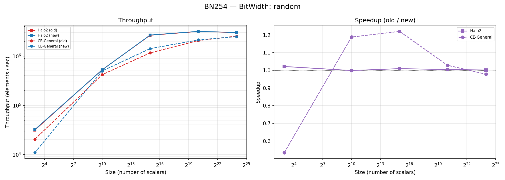

<em>Fig 6 — BN254 random: Throughput & Speedup</em>

**Throughput (elements / sec)**

| Method | Version | 8 | 1 024 | 32 768 | 1 048 576 | 16 777 216 |
|--------|---------|--:|------:|-------:|----------:|-----------:|
| Halo2 | old | 3.15e+04 | 5.26e+05 | 2.65e+06 | 3.16e+06 | 3.01e+06 |
| Halo2 | new | 3.22e+04 | 5.25e+05 | 2.68e+06 | 3.18e+06 | 3.02e+06 |
| CE-General | old | 2.05e+04 | 4.19e+05 | 1.16e+06 | 2.07e+06 | 2.54e+06 |
| CE-General | new | 1.09e+04 | 4.98e+05 | 1.42e+06 | 2.13e+06 | 2.49e+06 |

**Raw Latency**

| Method | Version | 8 | 1 024 | 32 768 | 1 048 576 | 16 777 216 |
|--------|---------|--:|------:|-------:|----------:|-----------:|
| Halo2 | old | 253.77 µs | 1.95 ms | 12.35 ms | 331.49 ms | 5.57 s |
| Halo2 | new | 248.38 µs | 1.95 ms | 12.23 ms | 329.97 ms | 5.56 s |
| CE-General | old | 390.82 µs | 2.44 ms | 28.18 ms | 506.68 ms | 6.59 s |
| CE-General | new | 731.16 µs | 2.06 ms | 23.10 ms | 492.61 ms | 6.74 s |

**Speedup (old / new)**

| Method | 8 | 1 024 | 32 768 | 1 048 576 | 16 777 216 |
|--------|--:|------:|-------:|----------:|-----------:|
| Halo2 | 1.02× | 1.00× | 1.01× | 1.00× | 1.00× |
| CE-General | 0.53× | 1.19× | 1.22× | 1.03× | 0.98× |

---

## Pallas Curve

### BitWidth: u1

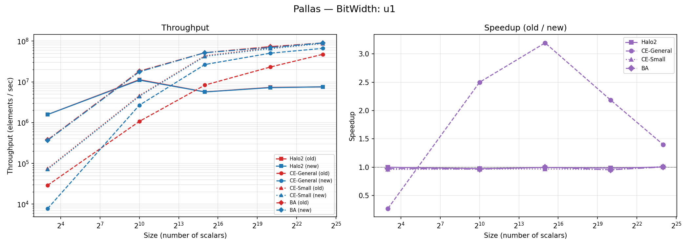

<em>Fig 7 — Pallas u1: Throughput & Speedup</em>

**Throughput (elements / sec)**

| Method | Version | 8 | 1 024 | 32 768 | 1 048 576 | 16 777 216 |
|--------|---------|--:|------:|-------:|----------:|-----------:|
| Halo2 | old | 1.58e+06 | 1.13e+07 | 5.69e+06 | 7.32e+06 | 7.54e+06 |
| Halo2 | new | 1.58e+06 | 1.11e+07 | 5.66e+06 | 7.22e+06 | 7.56e+06 |
| CE-General | old | 2.90e+04 | 1.07e+06 | 8.34e+06 | 2.32e+07 | 4.75e+07 |
| CE-General | new | 7.79e+03 | 2.68e+06 | 2.67e+07 | 5.07e+07 | 6.65e+07 |
| CE-Small | old | 7.45e+04 | 4.59e+06 | 4.37e+07 | 6.81e+07 | 8.69e+07 |
| CE-Small | new | 7.16e+04 | 4.44e+06 | 4.23e+07 | 6.52e+07 | 8.79e+07 |
| BA | old | 3.78e+05 | 1.83e+07 | 5.21e+07 | 7.33e+07 | 9.03e+07 |
| BA | new | 3.68e+05 | 1.77e+07 | 5.20e+07 | 6.99e+07 | 9.05e+07 |

**Raw Latency**

| Method | Version | 8 | 1 024 | 32 768 | 1 048 576 | 16 777 216 |
|--------|---------|--:|------:|-------:|----------:|-----------:|
| Halo2 | old | 5.07 µs | 90.33 µs | 5.76 ms | 143.17 ms | 2.23 s |
| Halo2 | new | 5.07 µs | 92.67 µs | 5.79 ms | 145.33 ms | 2.22 s |
| CE-General | old | 276.29 µs | 955.26 µs | 3.93 ms | 45.24 ms | 353.34 ms |
| CE-General | new | 1.03 ms | 382.06 µs | 1.23 ms | 20.70 ms | 252.32 ms |
| CE-Small | old | 107.39 µs | 223.10 µs | 750.54 µs | 15.39 ms | 193.09 ms |
| CE-Small | new | 111.73 µs | 230.86 µs | 775.11 µs | 16.08 ms | 190.94 ms |
| BA | old | 21.19 µs | 55.91 µs | 628.82 µs | 14.30 ms | 185.75 ms |
| BA | new | 21.71 µs | 57.95 µs | 629.92 µs | 15.00 ms | 185.34 ms |

**Speedup (old / new)**

| Method | 8 | 1 024 | 32 768 | 1 048 576 | 16 777 216 |
|--------|--:|------:|-------:|----------:|-----------:|
| Halo2 | 1.00× | 0.97× | 0.99× | 0.99× | 1.00× |
| CE-General | 0.27× | 2.50× | 3.20× | 2.19× | 1.40× |
| CE-Small | 0.96× | 0.97× | 0.97× | 0.96× | 1.01× |
| BA | 0.98× | 0.96× | 1.00× | 0.95× | 1.00× |

---

### BitWidth: u10

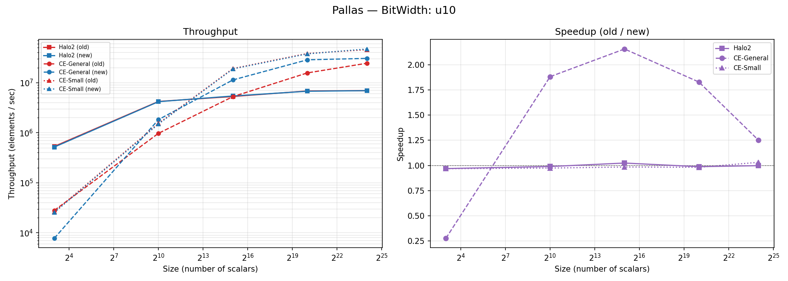

<em>Fig 8 — Pallas u10: Throughput & Speedup</em>

**Throughput (elements / sec)**

| Method | Version | 8 | 1 024 | 32 768 | 1 048 576 | 16 777 216 |
|--------|---------|--:|------:|-------:|----------:|-----------:|
| Halo2 | old | 5.34e+05 | 4.22e+06 | 5.30e+06 | 6.84e+06 | 6.95e+06 |
| Halo2 | new | 5.17e+05 | 4.18e+06 | 5.43e+06 | 6.76e+06 | 6.94e+06 |
| CE-General | old | 2.81e+04 | 9.75e+05 | 5.27e+06 | 1.57e+07 | 2.45e+07 |
| CE-General | new | 7.79e+03 | 1.83e+06 | 1.14e+07 | 2.87e+07 | 3.06e+07 |
| CE-Small | old | 2.64e+04 | 1.54e+06 | 1.92e+07 | 3.84e+07 | 4.58e+07 |
| CE-Small | new | 2.55e+04 | 1.50e+06 | 1.89e+07 | 3.77e+07 | 4.72e+07 |

**Raw Latency**

| Method | Version | 8 | 1 024 | 32 768 | 1 048 576 | 16 777 216 |
|--------|---------|--:|------:|-------:|----------:|-----------:|
| Halo2 | old | 14.99 µs | 242.44 µs | 6.18 ms | 153.32 ms | 2.41 s |
| Halo2 | new | 15.46 µs | 244.98 µs | 6.04 ms | 155.20 ms | 2.42 s |
| CE-General | old | 285.04 µs | 1.05 ms | 6.22 ms | 66.80 ms | 685.21 ms |
| CE-General | new | 1.03 ms | 558.55 µs | 2.88 ms | 36.55 ms | 547.81 ms |
| CE-Small | old | 303.25 µs | 665.95 µs | 1.71 ms | 27.31 ms | 366.60 ms |
| CE-Small | new | 313.25 µs | 683.64 µs | 1.74 ms | 27.82 ms | 355.54 ms |

**Speedup (old / new)**

| Method | 8 | 1 024 | 32 768 | 1 048 576 | 16 777 216 |
|--------|--:|------:|-------:|----------:|-----------:|
| Halo2 | 0.97× | 0.99× | 1.02× | 0.99× | 1.00× |
| CE-General | 0.28× | 1.88× | 2.16× | 1.83× | 1.25× |
| CE-Small | 0.97× | 0.97× | 0.98× | 0.98× | 1.03× |

---

### BitWidth: u16

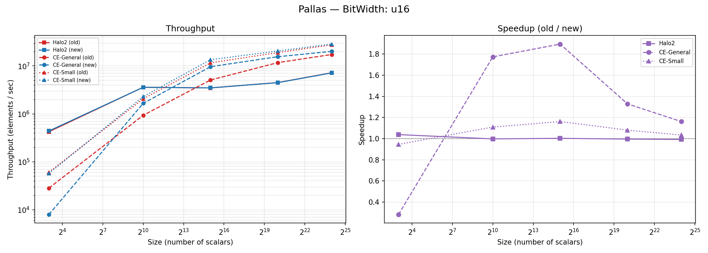

<em>Fig 9 — Pallas u16: Throughput & Speedup</em>

**Throughput (elements / sec)**

| Method | Version | 8 | 1 024 | 32 768 | 1 048 576 | 16 777 216 |
|--------|---------|--:|------:|-------:|----------:|-----------:|
| Halo2 | old | 4.23e+05 | 3.59e+06 | 3.48e+06 | 4.50e+06 | 7.21e+06 |
| Halo2 | new | 4.39e+05 | 3.58e+06 | 3.49e+06 | 4.48e+06 | 7.15e+06 |
| CE-General | old | 2.83e+04 | 9.33e+05 | 5.09e+06 | 1.17e+07 | 1.73e+07 |
| CE-General | new | 7.95e+03 | 1.66e+06 | 9.64e+06 | 1.56e+07 | 2.01e+07 |
| CE-Small | old | 6.06e+04 | 2.06e+06 | 1.16e+07 | 1.90e+07 | 2.76e+07 |
| CE-Small | new | 5.73e+04 | 2.29e+06 | 1.35e+07 | 2.05e+07 | 2.85e+07 |

**Raw Latency**

| Method | Version | 8 | 1 024 | 32 768 | 1 048 576 | 16 777 216 |
|--------|---------|--:|------:|-------:|----------:|-----------:|
| Halo2 | old | 18.90 µs | 284.90 µs | 9.43 ms | 232.97 ms | 2.33 s |
| Halo2 | new | 18.21 µs | 285.66 µs | 9.40 ms | 234.03 ms | 2.35 s |
| CE-General | old | 283.10 µs | 1.10 ms | 6.44 ms | 89.40 ms | 968.43 ms |
| CE-General | new | 1.01 ms | 618.32 µs | 3.40 ms | 67.28 ms | 833.97 ms |
| CE-Small | old | 132.06 µs | 496.61 µs | 2.82 ms | 55.20 ms | 607.92 ms |
| CE-Small | new | 139.68 µs | 447.61 µs | 2.43 ms | 51.10 ms | 587.98 ms |

**Speedup (old / new)**

| Method | 8 | 1 024 | 32 768 | 1 048 576 | 16 777 216 |
|--------|--:|------:|-------:|----------:|-----------:|
| Halo2 | 1.04× | 1.00× | 1.00× | 1.00× | 0.99× |
| CE-General | 0.28× | 1.77× | 1.89× | 1.33× | 1.16× |
| CE-Small | 0.95× | 1.11× | 1.16× | 1.08× | 1.03× |

---

### BitWidth: u32

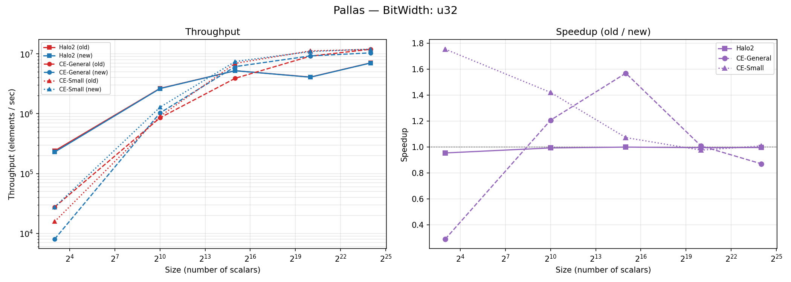

<em>Fig 10 — Pallas u32: Throughput & Speedup</em>

**Throughput (elements / sec)**

| Method | Version | 8 | 1 024 | 32 768 | 1 048 576 | 16 777 216 |
|--------|---------|--:|------:|-------:|----------:|-----------:|
| Halo2 | old | 2.39e+05 | 2.64e+06 | 5.22e+06 | 4.09e+06 | 7.05e+06 |
| Halo2 | new | 2.28e+05 | 2.62e+06 | 5.22e+06 | 4.07e+06 | 7.03e+06 |
| CE-General | old | 2.76e+04 | 8.52e+05 | 3.90e+06 | 9.15e+06 | 1.19e+07 |
| CE-General | new | 8.03e+03 | 1.03e+06 | 6.12e+06 | 9.23e+06 | 1.04e+07 |
| CE-Small | old | 1.57e+04 | 9.01e+05 | 6.93e+06 | 1.12e+07 | 1.19e+07 |
| CE-Small | new | 2.76e+04 | 1.28e+06 | 7.44e+06 | 1.09e+07 | 1.20e+07 |

**Raw Latency**

| Method | Version | 8 | 1 024 | 32 768 | 1 048 576 | 16 777 216 |
|--------|---------|--:|------:|-------:|----------:|-----------:|
| Halo2 | old | 33.46 µs | 387.36 µs | 6.27 ms | 256.39 ms | 2.38 s |
| Halo2 | new | 35.06 µs | 390.15 µs | 6.28 ms | 257.69 ms | 2.39 s |
| CE-General | old | 290.11 µs | 1.20 ms | 8.40 ms | 114.55 ms | 1.41 s |
| CE-General | new | 996.70 µs | 996.01 µs | 5.36 ms | 113.66 ms | 1.62 s |
| CE-Small | old | 508.62 µs | 1.14 ms | 4.73 ms | 93.73 ms | 1.41 s |
| CE-Small | new | 290.12 µs | 799.93 µs | 4.41 ms | 96.06 ms | 1.40 s |

**Speedup (old / new)**

| Method | 8 | 1 024 | 32 768 | 1 048 576 | 16 777 216 |
|--------|--:|------:|-------:|----------:|-----------:|
| Halo2 | 0.95× | 0.99× | 1.00× | 0.99× | 1.00× |
| CE-General | 0.29× | 1.21× | 1.57× | 1.01× | 0.87× |
| CE-Small | 1.75× | 1.42× | 1.07× | 0.98× | 1.01× |

---

### BitWidth: u64

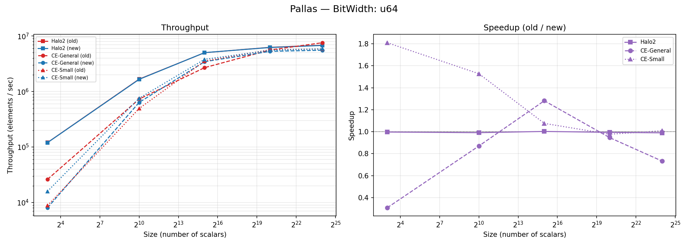

<em>Fig 11 — Pallas u64: Throughput & Speedup</em>

**Throughput (elements / sec)**

| Method | Version | 8 | 1 024 | 32 768 | 1 048 576 | 16 777 216 |
|--------|---------|--:|------:|-------:|----------:|-----------:|
| Halo2 | old | 1.20e+05 | 1.67e+06 | 5.01e+06 | 6.26e+06 | 6.84e+06 |
| Halo2 | new | 1.20e+05 | 1.66e+06 | 5.02e+06 | 6.22e+06 | 6.77e+06 |
| CE-General | old | 2.61e+04 | 7.32e+05 | 2.69e+06 | 5.61e+06 | 7.58e+06 |
| CE-General | new | 8.05e+03 | 6.36e+05 | 3.45e+06 | 5.30e+06 | 5.55e+06 |
| CE-Small | old | 8.80e+03 | 4.94e+05 | 3.53e+06 | 5.67e+06 | 5.83e+06 |
| CE-Small | new | 1.59e+04 | 7.55e+05 | 3.80e+06 | 5.54e+06 | 5.88e+06 |

**Raw Latency**

| Method | Version | 8 | 1 024 | 32 768 | 1 048 576 | 16 777 216 |
|--------|---------|--:|------:|-------:|----------:|-----------:|
| Halo2 | old | 66.46 µs | 612.38 µs | 6.54 ms | 167.54 ms | 2.45 s |
| Halo2 | new | 66.66 µs | 617.78 µs | 6.52 ms | 168.53 ms | 2.48 s |
| CE-General | old | 305.95 µs | 1.40 ms | 12.17 ms | 186.96 ms | 2.21 s |
| CE-General | new | 994.10 µs | 1.61 ms | 9.49 ms | 197.73 ms | 3.02 s |
| CE-Small | old | 909.12 µs | 2.07 ms | 9.27 ms | 185.00 ms | 2.88 s |
| CE-Small | new | 502.20 µs | 1.36 ms | 8.62 ms | 189.35 ms | 2.85 s |

**Speedup (old / new)**

| Method | 8 | 1 024 | 32 768 | 1 048 576 | 16 777 216 |
|--------|--:|------:|-------:|----------:|-----------:|
| Halo2 | 1.00× | 0.99× | 1.00× | 0.99× | 0.99× |
| CE-General | 0.31× | 0.87× | 1.28× | 0.95× | 0.73× |
| CE-Small | 1.81× | 1.53× | 1.08× | 0.98× | 1.01× |

---

### BitWidth: random

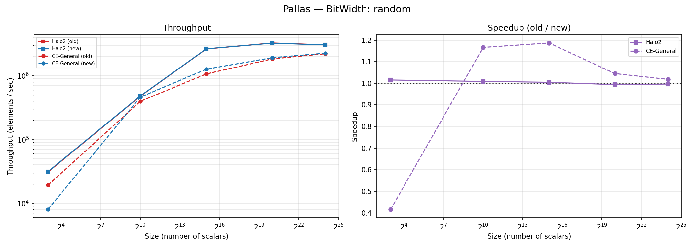

<em>Fig 12 — Pallas random: Throughput & Speedup</em>

**Throughput (elements / sec)**

| Method | Version | 8 | 1 024 | 32 768 | 1 048 576 | 16 777 216 |
|--------|---------|--:|------:|-------:|----------:|-----------:|
| Halo2 | old | 3.08e+04 | 4.78e+05 | 2.63e+06 | 3.26e+06 | 3.05e+06 |
| Halo2 | new | 3.13e+04 | 4.83e+05 | 2.64e+06 | 3.24e+06 | 3.03e+06 |
| CE-General | old | 1.92e+04 | 3.97e+05 | 1.07e+06 | 1.84e+06 | 2.21e+06 |
| CE-General | new | 7.98e+03 | 4.62e+05 | 1.27e+06 | 1.92e+06 | 2.25e+06 |

**Raw Latency**

| Method | Version | 8 | 1 024 | 32 768 | 1 048 576 | 16 777 216 |
|--------|---------|--:|------:|-------:|----------:|-----------:|
| Halo2 | old | 259.54 µs | 2.14 ms | 12.47 ms | 321.73 ms | 5.51 s |
| Halo2 | new | 255.63 µs | 2.12 ms | 12.41 ms | 323.76 ms | 5.53 s |
| CE-General | old | 417.08 µs | 2.58 ms | 30.67 ms | 570.49 ms | 7.58 s |
| CE-General | new | 1.00 ms | 2.21 ms | 25.85 ms | 546.00 ms | 7.45 s |

**Speedup (old / new)**

| Method | 8 | 1 024 | 32 768 | 1 048 576 | 16 777 216 |
|--------|--:|------:|-------:|----------:|-----------:|
| Halo2 | 1.02× | 1.01× | 1.00× | 0.99× | 1.00× |
| CE-General | 0.42× | 1.17× | 1.19× | 1.04× | 1.02× |

---

## Key Observations

1. **CE-General sees large speedups at mid-range sizes (1 K – 32 K)** across both curves and all bit-widths, with peak speedups of **2.8–3.8×** for u1 scalars.
2. **CE-Small and BA remain largely unchanged** — the optimization targets the general-purpose code path.
3. **CE-General regresses slightly at size = 8** (0.27–0.53×) due to higher setup overhead in the new code path, which is amortized at larger sizes.
4. **Halo2 baseline is unaffected** (speedup ≈ 1.00×), confirming the optimization is isolated to Nova's commitment engine.
5. At **16 M elements with u1 scalars on BN254**, CE-General achieves **7.45e+07 elem/s** (new) vs. **4.88e+07 elem/s** (old) — a **1.53× improvement**.